# Session 级 AI 观众与拟人化弹幕重构设计

> 状态：`Historical / Superseded`。本文保留 2026-07-24 的 Viewer 重构设计过程，不描述当前 Bun 后端实现。
>
> 日期：2026-07-24
>
> 历史范围：Electron 控制端、旧后端 Viewer Runtime、实时合同、SQLite 恢复、测试与调试
>
> 相关文档：[PRODUCT.md](./PRODUCT.md)、[ARCHITECTURE.md](./ARCHITECTURE.md)、[BACKEND_DESIGN.md](./BACKEND_DESIGN.md)、[VIEWER_RUNTIME_INTEGRATION_PLAN.md](./VIEWER_RUNTIME_INTEGRATION_PLAN.md)
>
> 当前替代文档：[AI 观众发言产品规格](./AUDIENCE_SPEAKING_PRODUCT_SPEC.md)、[系统架构](./ARCHITECTURE.md) 和 [Bun 后端详细设计](./BACKEND_DESIGN.md)。本文中的 Director、FastAPI、旧运行状态和“当前实现”措辞均只代表历史快照。

## 1. 文档目的

本文提出一套新的 AI 观众实体模型和弹幕生成算法，用于解决当前系统中“人格被当成观众，而不是人格赋予观众”的问题。

设计目标不是单纯让模型写出更像真人的句子，而是模拟一组具有独立身份、独立时序和独立发言意愿的 Session 级观众。一个观众需要能够：

- 在本场直播中拥有独立用户名、头像标识和稳定 Viewer ID。
- 从持久化 PersonaTemplate 库中获得一个人格模板。
- 加入直播间、暂时离开、重新加入和发送弹幕。
- 被主播限时禁言、解除禁言或踢出本场直播。
- 根据自己当时的注意力、兴趣、情绪、关系和冷却状态决定是否发言。
- 在决定发言后，自主选择回应主播、直播内容、整个房间或另一位观众。
- 在同一场直播内保持身份和行为连续，但不跨直播继承身份。

本文既是本次重构的设计依据，也是当前实现的行为边界。核心基线已落地；文中明确标注为可调参数、推荐节奏或后续阶段的内容，仍需通过长时间回放和真人观感测试继续校准。

## 2. 核心结论

本次重构采用以下核心模型：

1. PersonaTemplate 是持久化的人格素材，不是观众账号。
2. ViewerInstance 是本场 Session 临时创建的独立观众。
3. 每次新开直播都创建全新的 ViewerInstance；上一场观众不会出现在下一场。
4. Viewer 的用户名和头像独立于 Persona；同一 Persona 可以赋予多个不同 Viewer。
5. Viewer 的加入、离开和发言是彼此独立的行为过程。
6. Mode 的 `persona_counts` 直接表示每种人格的 Viewer 数；`0` 表示不参与，模式总人数由这些数值相加得出。
7. Director 负责理解场景和给出全局预算，不再直接集中指定准确发言者。
8. 每个在场 Viewer 独立计算发言意愿；全局仲裁器只负责密度、时效和多样性约束。
9. 只有经过本地候选筛选的少量 Viewer 才调用模型，不能每个事件都调用全部 Viewer。
10. 限时禁言和踢出必须在候选选择、请求调度和最终发布三个阶段生效。
11. AI 观众之间允许接话，但使用有界 social follow-up，不能形成无上限递归生成。
12. 所有随机行为使用 Session 级可重放随机源，并进入结构化 trace。

## 3. 已确认边界与建议方向

### 3.1 已确认的产品边界

以下内容来自本轮需求讨论，应视为本设计的固定输入：

- 直播结束后，本场所有观众都消失。
- 下一次直播重新创建一批新观众。
- PersonaTemplate 库可以跨直播保留并重复使用。
- Viewer 拥有自己的用户名等身份信息，Persona 只是赋予 Viewer 的行为模板。
- Viewer 可以加入、离开和发送弹幕。
- 主播可以限时禁言 Viewer，也可以将 Viewer 踢出直播间。
- AI 观众应尽可能从每个 Viewer 自己的角度模拟真人行为。
- 是否发言和说什么必须是两个明确的决策阶段。
- Viewer 可以围绕直播内容发言，也可以回应其他 Viewer 的公开弹幕。

### 3.2 本文推荐的行为语义

以下内容是本文给出的推荐实现，评审时仍可调整：

- Viewer 主动离开后，可以在同一 Session 中以原身份重新加入。
- Viewer 被踢出后，本 Session 内不能重新加入。
- Viewer 被禁言时仍然在场、仍能看到公开上下文，但不能生成或发布弹幕。
- 正常停止 Session 后删除 Viewer 私有运行状态；已发布弹幕仍作为 Room 公开事件保留。
- 后端意外重启不等同于主播正常关播。只要恢复的是同一个未终止 Session，就允许恢复本场 Viewer。
- Room 长期记忆可以跨 Session 保留，但对新 Viewer 只能作为频道公开背景或社区传闻，不能伪装成该 Viewer 的亲历记忆。
- 加入和离开默认只显示在控制台观众列表，不作为普通 Overlay 弹幕刷屏。

## 4. 当前实现评估

### 4.1 当前运行链路

当前 Viewer Runtime 的主要流程是：

```text
ModeDefinition
  -> 按 Persona 的精确人数创建 Viewer 池
  -> ObservationWave
  -> 本地计算最大响应数
  -> Director 选择准确 ViewerInstance ID
  -> 每个选中 Viewer 独立调用模型
  -> Viewer 返回 barrage 或 silence
  -> 时效、身份和 evidence 校验
  -> Overlay 与 RoomWorkingMemory
```

现有实现已经具备以下可复用基础：

- `viewer_instance_id`、`persona_id` 和 `display_name` 已分字段存在。
- Viewer 请求已经是一实例一调用，并支持合法 silence。
- Session、`audience_epoch`、Viewer sequence、TTL、latest-wins 和提交围栏已经存在。
- 每条已发布弹幕都带明确 Viewer ID、Persona ID 和 evidence refs。
- Room 公开事件、共享记忆、Debug trace 和 replay 已有基础设施。
- Viewer 池可持久化，用于同一逻辑 Session 的后端恢复。

### 4.2 当前主要问题

#### 4.2.1 身份仍由 Persona 派生

当前 Viewer 池按 Mode 中每个 Persona 的直接人数创建 `(persona_id, ordinal)` 席位。显示名由 Persona 名称加序号组成，例如 `某人格·02`。

这意味着数据类型虽然区分了 Viewer 与 Persona，但产品语义仍接近“人格复制出多个观众”。用户名、席位、热更新身份匹配和 Viewer 创建顺序都依赖 Persona。

#### 4.2.2 生命周期不代表真实在场状态

当前生命周期只有 `active` 和 `removed`。`removed` 主要表示配置热更新移除了一个池席位，不表示 Viewer 主动离开或被主播踢出。

系统尚未建模：

- 尚未加入。
- 当前在场。
- 主动离开。
- 同场重新加入。
- 被限时禁言。
- 被踢出并禁止本场重返。
- Session 正常结束。

#### 4.2.3 私有状态尚未形成更新闭环

现有 ViewerPrivateState 已声明 `attention`、`mood`、`cooldown_until_ms`、已发布事件和直接互动事件，但当前代码主要读取这些字段，缺少每波和每次公开行为后的权威状态转移。

没有状态更新闭环时，Viewer 的连续性主要依赖 Prompt，而不是真正的运行时行为。

#### 4.2.4 Director 过度集中决定发言者

当前 Director 直接输出准确 `selected_viewer_ids`。这种拓扑便于控制预算，但会让观众群像一个统一导演控制的合唱团：谁发言由一次集中决策产生，而不是每个 Viewer 分别产生发言冲动。

#### 4.2.5 Viewer 模型上下文不完整

当前 ViewerGenerationRequest 包含 Persona ID、Persona revision、实例微变体、Mode context、事件 ID 和 Room 长期记忆切片，但没有稳定地包含：

- 当前 Viewer 对应的完整、已解析 PersonaTemplate。
- 近期公开事件的正文、作者和目标关系。
- 当前场景的结构化主题与显著性。
- 可回复的具体 Viewer 和具体弹幕。

只提供事件 ID 不能让模型理解事件内容，也不能可靠地形成 Viewer 间接话。

#### 4.2.6 缺少主播管理合同

当前没有完整的禁言、解除禁言、踢出、Viewer presence snapshot 和 presence event 合同。即使领域对象增加字段，前端也无法可靠管理或观察这些状态。

## 5. 目标与非目标

### 5.1 目标

- 从领域模型上彻底分离 Persona、Viewer 身份和 Session 状态。
- 让同一 Persona 可以赋予用户名、头像和行为微变体不同的多个 Viewer。
- 让 Viewer 在 Session 内拥有可解释、可重放的加入、离开和发言行为。
- 让发言者选择主要来自 Viewer 独立意愿，而非一次集中式角色点名。
- 让 Viewer 在发言前明确选择意图和目标。
- 支持 Viewer 回应主播、画面、房间话题和其他 Viewer。
- 支持限时禁言、提前解除禁言和踢出。
- 确保任何过期、离场、禁言或被踢 Viewer 的结果都无法发布。
- 保持外部模型调用有界，避免观众数量直接放大成本。
- 保持 deterministic replay、结构化 trace 和机器可读失败原因。
- 提供完整的前端实时观众列表和主播管理操作。

### 5.2 非目标

- 不接入真实直播平台或真人账号。
- 不把模拟在线 Viewer 数包装为真实在线人数。
- 不让 Viewer 身份跨 Session 延续。
- 不为 Viewer 建立跨 Session 私有事实记忆。
- 不实现关注、订阅、礼物、付费或账号体系。
- 不在每个 ObservationWave 中调用全部在线 Viewer。
- 不允许 AI 弹幕无限递归触发 AI 弹幕。
- 不依赖模型自由修改权威生命周期、禁言或身份状态。
- 不在首版建立复杂的心理学仿真或机器学习行为模型。

## 6. 领域模型

### 6.1 所有权关系

```text
Room（跨 Session 持久）
  ├─ PersonaTemplate Library（跨 Session 持久）
  ├─ RoomLongTermMemory（跨 Session 持久）
  └─ Session（一次直播）
       └─ SessionAudience
            ├─ ViewerInstance A
            │    ├─ ViewerIdentity
            │    ├─ PersonaAssignment
            │    ├─ ViewerPresence
            │    ├─ ViewerModeration
            │    └─ ViewerBehaviorState
            ├─ ViewerInstance B
            └─ ...
```

### 6.2 PersonaTemplate

PersonaTemplate 继续作为持久化模板，负责定义 Viewer 如何观察、判断和表达。

建议保留或扩展的字段包括：

- `persona_id`
- `revision`
- `display_name`，仅作为人格模板名称，不作为 Viewer 用户名
- `role`
- `traits`
- `speech_style`
- `behavior`
- `trigger_preferences`
- `avoid_patterns`
- `silence_bias`
- `burst_bias`
- `repetition_bias`
- `cooldown_ms`
- `content_flags`
- `enabled`

PersonaTemplate 不拥有以下内容：

- Viewer 用户名。
- Viewer 头像。
- Viewer presence。
- Viewer 禁言或踢出状态。
- Viewer 本场发言历史。
- Viewer 跨 Session 私有记忆。

### 6.3 ViewerInstance

ViewerInstance 是本场直播中的观众聚合根。建议字段如下：

```text
ViewerInstance
  viewer_instance_id
  room_id
  session_id
  audience_epoch
  creation_ordinal
  identity
  persona_assignment
  variant
  presence
  moderation
  behavior_state
  viewer_sequence
  presence_revision
  moderation_revision
  behavior_revision
  created_at_ms
```

关键约束：

- `viewer_instance_id` 在当前 Session 内唯一且永不复用。
- ViewerInstance 不允许换绑到另一个 Session。
- Viewer 主动离开再加入时保留同一个 `viewer_instance_id`。
- 被踢 Viewer 的 `viewer_instance_id` 本场不可重新激活。
- PersonaTemplate 热更新可以更新 assignment revision，但不能把用户名改成人格名。
- 正常结束 Session 后，ViewerInstance 不会成为下一 Session 的输入。

### 6.4 ViewerIdentity

ViewerIdentity 是与 Persona 无关的本场身份：

```text
ViewerIdentity
  username
  display_name
  avatar_seed
  color_seed
  locale
```

第一版不需要模拟真实个人资料。用户名和头像只需满足：

- 与 Persona 名称无系统性绑定。
- 在当前 Session 中唯一。
- 本场稳定。
- 不包含保留词、冒充官方身份的词或被屏蔽内容。
- recorded replay 在固定 seed 下可重现。
- UI 始终明确其为 AI Viewer。

### 6.5 PersonaAssignment

PersonaAssignment 表示人格被赋予某个 Viewer，而不是人格本身成为 Viewer：

```text
PersonaAssignment
  persona_id
  persona_revision
  persona_content_hash
  assigned_at_ms
  assignment_source = mode_weight | explicit
```

Viewer 请求必须使用 assignment 指向的完整、已解析 Persona 内容。只传 Persona ID 或 revision 不足以驱动模型行为。

### 6.6 ViewerPresence

建议使用以下生命周期：

```text
not_joined -> active -> left -> active
      |          |        |
      +----------+--------+-> kicked

任何非终态 --Session stop--> ended
```

枚举建议：

- `not_joined`：身份已创建，但尚未进入房间。
- `active`：当前在场，可以感知公开上下文。
- `left`：主动离开，当前不参与感知和生成，但允许同场重新加入。
- `kicked`：被主播踢出，本 Session 终态。
- `ended`：Session 已正常结束，逻辑终态。

`muted` 不属于 presence 枚举。禁言是与在场状态正交的 moderation 状态。

建议字段：

```text
ViewerPresence
  state
  joined_at_ms
  last_left_at_ms
  join_count
  planned_presence_until_ms
  next_rejoin_eligible_at_ms
  ended_at_ms
```

### 6.7 ViewerModeration

```text
ViewerModeration
  muted_until_ms
  mute_reason
  kicked_at_ms
  kick_reason
  updated_by
  revision
```

约束：

- `muted_until_ms <= now` 等价于未禁言，但应通过显式状态更新发出 unmuted event。
- `kicked_at_ms` 一旦存在，本 Session 不允许清除。
- 踢出 Viewer 必须同时转为 `presence.state = kicked`。
- 主播管理命令必须幂等。

### 6.8 ViewerBehaviorState

ViewerBehaviorState 只在当前 Session 中存在，建议包括：

```text
ViewerBehaviorState
  attention_topics
  attention_strength
  mood
  arousal
  fatigue
  engagement
  last_spoke_at_ms
  last_reacted_at_ms
  cooldown_until_ms
  recent_published_event_ids
  recent_direct_interaction_event_ids
  current_thread_id
  current_target_viewer_id
  host_affinity
  peer_affinities
  silence_streak
  speech_streak
  revision
```

边界：

- 这些字段描述本场暂态，不是跨场人格成长。
- 公开事实来自 Room 上下文，不复制进 Viewer 私有事实库。
- `peer_affinities` 只表示本场互动倾向，不证明现实关系。
- 第一版状态变化由本地规则决定，不能直接接受模型自由输出的状态覆盖。

### 6.9 ViewerInstanceVariant

现有微变体应从语言风格扩展到行为差异，建议包含：

- `activity_baseline`
- `attention_span`
- `social_initiative`
- `reply_affinity`
- `expression_length`
- `skepticism`
- `encouragement`
- `meme_affinity`
- `silence_tendency`
- `stay_duration_tendency`
- `rejoin_tendency`

微变体由 Session seed、Viewer creation ordinal 和 Persona assignment 确定性派生。同一 Persona 的不同 Viewer 因此会有可观察但不违背核心人格的差异。

## 7. Session Audience 与模式语义

### 7.1 SessionAudience

每个 Session 拥有一个 SessionAudience 聚合：

```text
SessionAudience
  session_id
  room_id
  audience_epoch
  session_seed
  active_mode_id
  target_concurrent_viewers
  active_viewer_ids
  known_viewer_ids
  next_creation_ordinal
  population_revision
```

SessionAudience 是 Viewer 创建、在线人数控制、恢复和 deterministic replay 的权威边界。

### 7.2 `persona_counts` 的配置含义

当前 workspace schema 使用：

```text
persona_counts: { persona_id: 0..32 }
```

每个值就是该 Persona 的 Viewer 数，`0` 表示不参与；模式总人数为所有值的合计，必须在 1 到 32 之间。`target_concurrent_viewers` 只作为 SessionAudience 和持久化层的派生兼容字段，不是可编辑配置。

硬约束：

- 同时 `active` Viewer 不超过 32。
- 一个 Session 内创建过的唯一 Viewer 总数必须有可配置上限，防止长直播无限增长。
- `kicked` Viewer 计入已创建总数，但不计入在线数。
- Viewer 离开后，系统只会重新加入或创建当前人格配额仍有缺额的 Viewer。

### 7.3 Persona 人数的运行时含义

Mode 中的 Persona 人数决定精确的 PersonaAssignment：

```text
new Viewer
  -> 从当前 Mode 中人数尚未补足的 enabled Persona 选择
  -> 创建独立 ViewerIdentity
  -> 派生 ViewerInstanceVariant
  -> 进入 not_joined 或 active
```

人数不决定用户名，也不直接决定某一波谁发言。新建或重返 Viewer 只填补其 Persona 的当前缺额；固定 Session seed 时实例顺序和微变体可重放。

## 8. Viewer 身份生成

### 8.1 生成时机

Viewer 可以在计划加入前创建，也可以在加入事件发生时惰性创建。本文推荐惰性创建：

- 减少从未出现的无用 Viewer。
- `creation_ordinal` 自然对应实际加入顺序。
- 长直播中的观众更替更容易控制。
- replay 只需重放 population controller 的决定。

同场重新加入不会创建新身份，而是激活原 ViewerInstance。

### 8.2 用户名生成器

第一版推荐使用本地、可审查的用户名生成器，不使用 LLM：

- 从多个经过内容审核的词表和格式模板组合用户名。
- 根据界面语言选择合适词表。
- 支持普通词组、兴趣词、短昵称和可选数字后缀。
- 对结果执行 casefold 唯一性检查。
- 拒绝官方、管理员、主播本人、真实平台认证等保留词。
- 拒绝屏蔽词和疑似敏感个人信息格式。
- 冲突时使用确定性后缀重试。

建议种子：

```text
hash(session_seed, creation_ordinal, "viewer-identity-v1")
```

不得将 `persona_id` 或 Persona display name 作为用户名种子的主要输入，否则身份仍会与人格产生可见绑定。

### 8.3 头像与颜色

第一版可以使用本地头像素材、几何头像或受控图标组合，通过 `avatar_seed` 确定性选择。不要使用看起来像真实用户照片的素材，也不要让 UI 混淆 AI 与真人。

Overlay 和控制台可以继续使用颜色辅助识别，但颜色不能成为唯一身份信息。

## 9. 加入、离开与在线人数控制

### 9.1 Population Controller

新增 SessionAudiencePopulationController，独立于弹幕生成管线运行。它负责：

- 开播后的观众进入节奏。
- 围绕目标在线人数补入新 Viewer。
- 为 active Viewer 安排可能的主动离开。
- 决定 left Viewer 是否在同场重新加入。
- 在 Viewer 被踢出后按策略补位。
- 对暂停和停止作出一致响应。

Population Controller 不调用外部模型。所有决定由本地策略和可重放随机源完成。

### 9.2 开播进入节奏

不建议在 Session 进入 running 的同一毫秒让全部 Viewer 同时出现。推荐：

1. 创建少量初始 Viewer，使直播间立即可用。
2. 在一个可配置 ramp-up 窗口内逐步接近目标在线数。
3. 对加入时间增加 Viewer 级 jitter。
4. 暂停期间不创建新的加入事件。
5. 恢复后从当前时间重新调度，不补放暂停期间积压的加入事件。

具体初始比例和时间窗口属于可调参数，不在本文锁死。

### 9.3 主动离开

Viewer 离开概率受以下因素影响：

- 已在场时长。
- `stay_duration_tendency`。
- 当前 engagement。
- 长时间没有真实输入。
- 最近是否被直接点名或参与对话。
- Session 是否暂停。

离开必须产生权威 presence transition，并使所有旧请求立即失效。离开不是删除 Viewer。

### 9.4 同场重新加入

left Viewer 的重新加入概率受以下因素影响：

- `rejoin_tendency`。
- 离开时长。
- 当前在线数是否低于目标。
- 近期是否出现高显著事件。
- 该 Viewer 本场 engagement 和互动历史。

重新加入时：

- 保留 Viewer ID、用户名、PersonaAssignment 和 ViewerBehaviorState。
- 增加 `join_count` 和 `presence_revision`。
- 旧 presence revision 的在途输出不能发布。

### 9.5 Session 结束

主播正常停止直播时：

1. Session 停止接受新的观察、presence tick 和生成请求。
2. 递增或终止 epoch，取消所有 Viewer mailbox 和延时发布任务。
3. 将所有非终态 Viewer 转为 ended。
4. 删除不再用于恢复的 Viewer 私有状态和 moderation 状态。
5. 保留已经公开的 RoomEvent、必要 trace 和长期记忆候选。
6. 下一 Session 使用新 `session_id` 和新随机 `session_seed`，创建全新 Viewer。

后端异常退出时不执行“正常停止”语义。若桌面端选择恢复同一未终止 Session，可以从持久快照恢复原 Viewer；若用户明确结束或放弃恢复，则按停止语义清理。

## 10. 拟人化弹幕决策总流程

```mermaid
flowchart LR
    INPUT["画面、主播文字、final voice、受控 tick"] --> WAVE["ObservationWave"]
    WAVE --> SCENE["Scene Director：主题、显著性、证据、全局预算"]
    SCENE --> ELIGIBLE["过滤 active、未禁言、未冷却 Viewer"]
    ELIGIBLE --> DESIRE["每个 Viewer 独立计算发言意愿"]
    DESIRE --> SAMPLE["可重放概率采样"]
    SAMPLE --> ARBITER["密度、多样性和时效仲裁"]
    ARBITER --> REQUESTS["少量独立 Viewer 请求"]
    REQUESTS --> OUTPUT["silence 或带目标的 barrage"]
    OUTPUT --> DELAY["拟人化延时与最终围栏"]
    DELAY --> PUBLISH["Overlay 与公开 RoomEvent"]
    PUBLISH --> STATE["更新 Viewer 本场状态"]
    PUBLISH --> SOCIAL["有界 social follow-up"]
```



该流程把“理解场景”“我是否想说”“我想回应谁”“具体说什么”和“什么时候显示”拆成不同责任。

## 11. Scene Director

### 11.1 职责变化

现有 Director 直接选择准确 Viewer ID。重构后，Director 改为输出不绑定具体 Viewer 的 SceneAssessment：

```text
SceneAssessment
  assessment_id
  room_id
  session_id
  audience_epoch
  observation_id
  salience
  topics
  emotional_tone
  novelty
  highlight
  replyable_event_ids
  evidence_event_ids
  evidence_frame_indexes
  maximum_responses
  suggested_reaction_types
  created_at_ms
  expires_at_ms
```

Director 可以使用模型理解画面、主播语音和公开事件，但不能直接输出弹幕正文，也不应直接点名发言 Viewer。

### 11.2 本地硬约束

FastAPI 继续负责：

- 根据 Mode 计算 hard maximum。
- 检查 evidence refs。
- 检查 assessment scope、epoch 和 TTL。
- 限制可回复事件必须来自当前公开上下文。
- Director 失败时按 strict/resilient 策略安静或使用明确 fallback。

`minimum` 不应强迫不感兴趣的 Viewer 发言。它只能作为软目标，不能为了凑数量制造不相关弹幕。

### 11.3 点名例外

主播准确点名 Viewer 时，本地系统将该 Viewer 标记为强制评估对象，但仍遵守：

- Viewer 必须 active。
- Viewer 不能处于禁言状态。
- Viewer 不能已被踢出。
- 请求仍可返回 silence，例如上下文不足或内容安全拒绝。

如果点名对象已离开、被禁言或被踢出，系统不应偷偷换另一个 Viewer 冒充回应。

## 12. 每个 Viewer 的发言意愿

### 12.1 硬资格过滤

Viewer 在计算概率前必须满足：

- 属于当前 Session、Room 和 audience epoch。
- `presence.state == active`。
- 未被禁言。
- 未被踢出。
- Viewer cooldown 已结束。
- 当前 wave 未过期。
- Viewer mailbox 和全局队列仍有容量。
- 当前没有更新 revision 已使该 Viewer 的状态失效。

不满足硬资格时，trace 记录明确原因，但不调用模型。

### 12.2 发言意愿模型

第一版使用可解释的本地评分，不使用另一个 LLM 为所有 Viewer 做预筛选。

建议形式：

```text
z = base_activity
  + topic_relevance
  + direct_mention
  + reply_impulse
  + agreement_or_disagreement
  + emotional_activation
  + novelty
  + engagement
  + mood_effect
  - silence_bias
  - cooldown_penalty
  - fatigue
  - recent_speaker_penalty
  - crowd_pressure

p_speak = sigmoid(z)
```

所有分量应归一化并进入 trace。初始权重来自手工配置，后续根据 telemetry 调整。

### 12.3 主要特征

| 特征 | 含义 |
| --- | --- |
| `base_activity` | Viewer 微变体的基础活跃程度 |
| `topic_relevance` | Scene topics 与 Persona trigger/preferences、当前 attention 的匹配 |
| `direct_mention` | 主播或有效公开消息是否准确点名该 Viewer |
| `reply_impulse` | 当前是否存在该 Viewer 倾向回应的公开 Viewer 弹幕 |
| `agreement_or_disagreement` | Persona 立场与公开观点的认同或冲突强度 |
| `emotional_activation` | 场景情绪强度与 Viewer encouragement/skepticism 的组合 |
| `novelty` | 本轮是否有新信息，避免反复评论相同画面 |
| `engagement` | Viewer 当前对本场内容的投入程度 |
| `fatigue` | 在场过久、近期多次参与或连续无真实输入产生的疲劳 |
| `recent_speaker_penalty` | 防止同一个 Viewer 连续垄断弹幕 |
| `crowd_pressure` | 当前待显示和近期已显示弹幕越多，新增发言概率越低 |

### 12.4 可重放随机采样

不能直接使用进程全局随机数。每次抽样使用稳定 scope：

```text
draw = PRNG(
  session_seed,
  audience_epoch,
  observation_id,
  viewer_instance_id,
  behavior_revision,
  "speak-v1"
)

candidate = draw < p_speak
```

这样 recorded replay 能解释“概率是多少、随机抽样是多少、为何入选或沉默”。

### 12.5 不应出现的行为

- 所有 Viewer 因同一事件同时发言。
- 固定由最活跃的几个人反复发言。
- 每次主播说话都至少有人强制回应。
- Persona 只通过口头禅区分，关注对象和立场完全相同。
- Viewer 明明离场或禁言，旧请求仍然显示。
- 为了达到 response minimum 生成与上下文无关的弹幕。

## 13. Crowd Arbiter

多个 Viewer 独立成为候选后，由本地 CrowdArbiter 执行全局约束。

### 13.1 职责

- 不超过 SceneAssessment 和 Mode 给出的 hard maximum。
- 不超过当前 Overlay 密度和队列容量。
- 对直接点名 Viewer给予优先级。
- 使用加权无放回抽样，而不是固定取最高分。
- 对近期高频发言 Viewer 增加多样性惩罚。
- 避免所有候选都来自同一 Persona 或同一反应类型。
- 保留 0 人入选的合法结果。

### 13.2 响应预算

Mode 的 normal/highlight response range 继续存在，但语义调整为：

- `maximum` 是硬上限。
- `minimum` 是场景活跃时的软目标。
- 候选不足、上下文不足或全部 Viewer 选择 silence 时允许低于 minimum。
- ambient 或 social follow-up 使用更小的独立预算。

### 13.3 公平性

系统不追求每人发言次数完全相等。真人观众本来就有活跃差异，但需要防止模型成本和排序算法导致固定少数 Viewer 永久垄断。

建议观测：

- 每 Viewer 发言次数分布。
- 说话者集中度或 Gini coefficient。
- 连续由同一 Viewer 发言的比例。
- Persona 分配比例与实际发言比例。
- 主播、画面、Viewer-to-Viewer 三类目标比例。

## 14. Viewer 独立生成请求

### 14.1 请求必须携带的内容

每个最终候选 Viewer 获得独立 ViewerGenerationRequest。请求必须包含：

1. Viewer 身份
   - Viewer ID
   - 用户名和显示名
   - 头像/颜色只需语义标识，不发送无关二进制资源
2. 完整 Persona
   - 已解析的 PersonaTemplate
   - Mode override 合并结果
   - Persona revision 和 content hash
3. Viewer 本场状态
   - attention、mood、engagement、fatigue、cooldown
   - 最近自己的公开发言和直接互动引用
   - 当前对话 thread 和可用 peer affinity 摘要
4. SceneAssessment
   - topics、salience、tone、novelty、replyable events
5. 完整公开上下文
   - 事件 ID、来源、作者 Viewer ID、显示名、正文、时间和目标
   - 不能只提供 event ID
6. 视觉上下文
   - direct frames 或 shared summary
7. Room 记忆切片
   - 明确标记为频道公开背景、共同 lore 或主播事实
8. 允许的目标集合
   - 主播
   - 当前画面/场景
   - 可回复的公开 event IDs
   - 当前 active Viewer IDs
9. 并发围栏
   - audience epoch
   - viewer sequence
   - presence revision
   - moderation revision
   - behavior revision
   - deadline

### 14.2 Persona 与身份的 Prompt 边界

Prompt 必须明确：

- 用户名代表“你是谁”。
- PersonaTemplate 代表“你倾向如何观察、判断和表达”。
- 不要把 Persona display name 当作自己的用户名。
- 不要声称自己是 Persona 模板或系统角色。
- 不要因为共享 Room 记忆而声称自己亲历了上一场直播。

### 14.3 输出合同

建议输出：

```text
ViewerGenerationResponse
  generation_request_id
  viewer_instance_id
  viewer_sequence
  action = barrage | silence
  intent
  target
  text
  reaction_type
  evidence_refs
```

其中：

```text
target
  kind = host | scene | room | viewer | event
  viewer_instance_id?
  event_id?
```

约束：

- `silence` 不包含 text 和 target。
- `viewer` target 必须是当前 active Viewer。
- `event` target 必须出现在允许回复的公开事件中。
- 每个 Viewer 每波最多一条弹幕。
- 模型不能输出生命周期、禁言或身份修改。
- 模型可以返回建议 intent，但本地校验器有最终决定权。

### 14.4 意图类型

首版建议使用有限枚举：

- `react_to_host`
- `react_to_scene`
- `reply_to_viewer`
- `ask_question`
- `agree`
- `disagree`
- `encourage`
- `joke`
- `continue_thread`
- `room_meta`
- `silence`

有限枚举便于测试、密度控制和 telemetry。具体文案仍由模型生成。

## 15. 拟人化显示时序

模型完成时间不应直接等于弹幕显示时间。ViewerBarrageScheduler 根据以下因素生成短延时：

- 文本长度。
- Viewer expression length 和反应速度微变体。
- 当前弹幕密度。
- 直接点名是否需要优先响应。
- 同一波其他 Viewer 已安排的显示时间。
- 可重放 jitter。

所有延时仍受 Observation TTL 约束。到达计划显示时间时必须重新检查：

- Session 是否仍运行。
- audience epoch 是否仍有效。
- Viewer 是否仍 active。
- Viewer 是否刚被禁言或踢出。
- presence/moderation/behavior revision 是否匹配。
- 内容是否仍未过期。

任何检查失败都丢弃结果，不补位、不延后到恢复后发布。

## 16. Viewer 状态更新

### 16.1 更新原则

- 只有通过本地校验并成功提交的公开弹幕才能进入 `recent_published_event_ids`。
- Provider 失败、过期、被拒绝或被围栏丢弃不能伪装成 Viewer 已发言。
- silence 可以影响 `silence_streak`，但不能写入公开发言历史。
- 所有状态更新必须带 behavior revision 并原子提交。
- 模型输出不能直接覆盖权威状态。

### 16.2 发布后的本地更新

一条弹幕成功发布后，建议更新：

- `last_spoke_at_ms`
- `last_reacted_at_ms`
- `cooldown_until_ms`
- `speech_streak`
- `silence_streak = 0`
- `fatigue`
- `engagement`
- `current_thread_id`
- `current_target_viewer_id`
- `recent_published_event_ids`
- 对主播或目标 Viewer 的本场 affinity

更新幅度由 Persona、Viewer variant 和 reaction type 共同决定。

### 16.3 每波感知后的更新

没有发言的 Viewer 仍可发生轻量状态变化：

- attention topics 随新场景迁移或衰减。
- mood/arousal 随显著事件改变。
- fatigue 随时间恢复或增加。
- engagement 随相关内容升降。
- silence streak 增长。

为了控制成本，这些变化使用本地规则，不为每个 Viewer 调用模型。

## 17. Viewer 之间的互动

### 17.1 公开上下文

所有成功发布的 Viewer 弹幕继续进入 RoomWorkingMemory，后续 active Viewer 可以看到其作者、正文、时间、reaction type 和 reply target。

Viewer 回复另一个 Viewer 时，输出必须带 `target.viewer_instance_id` 或 `target.event_id`，不能只在文字里模糊模拟回复关系。

### 17.2 有界 Social Follow-up

如果完全禁止 AI 弹幕触发后续评估，Viewer 间互动只能等到下一次主播输入，体验会显得断裂；如果每条 AI 弹幕立即递归触发完整链路，又会产生无限对话和成本失控。

推荐新增有界 SocialFollowupScheduler：

1. 成功发布的 Viewer 弹幕可以成为 social candidate root。
2. Scheduler 在短 debounce 窗口内合并相近公开弹幕。
3. 只评估对目标 Viewer 有回复倾向的少量 active Viewer。
4. 使用独立且更小的 social response budget。
5. social follow-up 带 `chain_id` 和 `depth`。
6. 首版推荐 `max_depth = 1`，即根弹幕最多产生一层回复。
7. social follow-up 产生的弹幕不再创建下一层 follow-up。
8. 仍受 mute、kick、cooldown、TTL、密度和语义去重约束。

具体 debounce、概率和最大条数属于可调参数。

## 18. 主播禁言与踢出

### 18.1 限时禁言

主播选择 Viewer 和禁言时长后，后端执行：

1. 校验 Viewer 属于当前 active Session。
2. 原子更新 `muted_until_ms` 和 `moderation_revision`。
3. 取消 Viewer 当前 mailbox 中尚未提交的请求和延时弹幕。
4. 发布 `viewer.muted` 实时事件。
5. 在 Viewer 快照中返回权威截止时间。

禁言期间：

- Viewer 保持 active。
- Viewer 可以继续接收公开上下文并更新 attention/mood。
- Viewer 不进入发言候选。
- 旧 moderation revision 的输出无法通过最终围栏。

禁言到期后，后端发布 `viewer.unmuted`。前端倒计时仅用于显示，不能成为权威解禁器。

### 18.2 提前解除禁言

主播可以提前解除禁言。命令同样递增 moderation revision，并发布权威事件。重复解除应幂等成功或返回明确 no-op，不应报内部错误。

### 18.3 踢出

踢出执行：

1. 原子设置 `presence.state = kicked`。
2. 写入 `kicked_at_ms`、reason 和新的 presence/moderation revision。
3. 取消所有在途和延时输出。
4. 发布 `viewer.kicked`。
5. 从 active audience snapshot 移除。
6. Population Controller 可以创建新 Viewer 补足目标在线数。

被踢 Viewer 在当前 Session 中不能重新加入。第一版不提供撤销踢出；永久封禁不在本设计范围。

### 18.4 主动离开与踢出的区别

| 行为 | 是否保留身份 | 是否允许同场回来 | 是否可以感知上下文 | 是否允许发言 |
| --- | --- | --- | --- | --- |
| active | 是 | 已在场 | 是 | 视禁言状态 |
| left | 是 | 是 | 否 | 否 |
| muted active | 是 | 已在场 | 是 | 否 |
| kicked | 仅保留本场审计引用 | 否 | 否 | 否 |
| ended | 不再作为运行实体 | 否 | 否 | 否 |

## 19. 后端设计

### 19.1 新增或重构的领域模块

| 模块 | 职责 |
| --- | --- |
| `domain/viewer.py` | Viewer 聚合、identity、presence、moderation、behavior state 与不变量 |
| `domain/viewer_intent.py` | 发言 intent、target 和响应合同的领域表示 |
| `domain/scene_assessment.py` | Director 场景理解结果 |
| `application/viewer_identity_factory.py` | 独立用户名、头像种子、PersonaAssignment 和微变体生成 |
| `application/viewer_population_service.py` | 加入、离开、重返和在线目标控制 |
| `application/viewer_behavior_service.py` | 每 Viewer 发言意愿特征与概率 |
| `application/crowd_arbiter.py` | 全局预算、密度、多样性和概率仲裁 |
| `application/viewer_moderation_service.py` | mute、unmute、kick 与取消围栏 |
| `application/social_followup_scheduler.py` | 有界 Viewer-to-Viewer 后续互动 |

模块名可以结合实现调整，但责任边界应保留。

### 19.2 现有模块调整

#### `viewer_pool_service.py`

- 不再按 Persona 配额一次性创建固定池。
- 改为维护 SessionAudience 和当前 Viewer snapshots，或由新的 population service 取代。
- 热更新保留 ViewerIdentity，不根据 `(persona_id, ordinal)` 重建身份。
- Persona 内容变化只更新对应 assignment revision，并按规则重置受影响的行为状态。

#### `director_service.py`

- 输出 SceneAssessment，不再输出准确 Viewer ID 列表。
- 继续执行一次调用、TTL、证据和 strict/resilient 校验。

#### `viewer_policies.py`

- 拆分为行为评分、硬资格过滤和 crowd budget。
- cooldown、presence 和 moderation 都必须参与资格判断。

#### `viewer_runtime.py`

- ViewerGenerationRequest 携带完整 resolved Persona 与公开事件正文。
- 请求和发布围栏增加 presence、moderation 和 behavior revisions。
- 支持拟人化延时发布。
- Viewer 离开、禁言或被踢时按 Viewer ID 取消 mailbox。

#### `viewer_runtime_coordinator.py`

- 调用 Scene Director 后进入 per-Viewer desire 和 CrowdArbiter。
- 只为最终候选构建独立 Viewer 请求。
- 成功发布后提交 ViewerBehaviorState 更新。
- 将符合条件的公开 Viewer 弹幕交给 SocialFollowupScheduler。

#### `runtime_state.py` 与 `runtime_session_service.py`

- Runtime snapshot 增加 SessionAudience state。
- 支持 presence/moderation revision 的 compare-and-swap。
- 正常停止时清理 Viewer 私有状态。
- 恢复同一未终止 Session 时恢复 ViewerIdentity 与状态。

### 19.3 应用服务权威边界

- Population Service 是 join/leave 的唯一写入者。
- Moderation Service 是 mute/kick 的唯一写入者。
- Viewer Behavior Service 只计算，不直接发布。
- Viewer Runtime 只提交通过最终围栏的弹幕。
- Room Service 是公开事件序列的唯一权威写入者。
- 前端不能直接修改 Viewer 状态，只能发送命令。

## 20. HTTP 与 WebSocket 合同

### 20.1 Audience Snapshot

建议新增或扩展：

```text
GET /runtime/sessions/{session_id}/audience
```

返回：

```text
SessionAudienceSnapshot
  session_id
  room_id
  audience_epoch
  population_revision
  target_concurrent_viewers
  active_count
  viewers[]
```

ViewerSnapshot 至少包含：

```text
viewer_instance_id
username
display_name
avatar_ref or avatar_seed
persona_id
persona_display_name
presence_state
joined_at_ms
join_count
muted_until_ms
viewer_sequence
presence_revision
moderation_revision
```

不要把完整私有 mood、affinity 或内部概率暴露给普通 UI。Debug API 可以提供受控快照。

### 20.2 主播命令

建议合同：

```text
POST /runtime/sessions/{session_id}/viewers/{viewer_id}/mute
POST /runtime/sessions/{session_id}/viewers/{viewer_id}/unmute
POST /runtime/sessions/{session_id}/viewers/{viewer_id}/kick
```

Mute body：

```text
MuteViewerRequest
  command_id
  duration_ms
  reason?
```

Kick body：

```text
KickViewerRequest
  command_id
  reason?
```

约束：

- `command_id` 用于幂等。
- duration 有本地最小值和最大值。
- 所有响应返回更新后的 ViewerSnapshot。
- session/viewer 不匹配、已结束、已踢出等错误必须机器可读。
- 接口继续受本机短期 token 保护。

### 20.3 实时事件

建议新增 WebSocket 消息：

- `viewer.joined`
- `viewer.left`
- `viewer.rejoined`
- `viewer.muted`
- `viewer.unmuted`
- `viewer.kicked`
- `audience.snapshot`
- `audience.population_changed`

每条消息必须带：

- protocol version
- session ID
- audience epoch
- population/presence/moderation revision
- ViewerSnapshot 或最小合法 delta
- occurred_at_ms

前端发现 revision 缺口时应重新获取完整 snapshot，而不是猜测中间状态。

### 20.4 合同版本

该变更会改变 Viewer、Mode 和实时消息语义。推荐：

- `AUDIENCE_CONTRACT_VERSION` 从 1 升到 2。
- Electron workspace schema 从 2 升到 3。
- 如果 WebSocket 客户端需要新增必处理消息或修改现有 snapshot，`PROTOCOL_VERSION` 从 2 升到 3。
- 如果所有实时变化都能严格保持向后兼容，可以保留 protocol v2，但必须用合同测试证明旧客户端不会误解析。

本文推荐直接升级 protocol v3，避免同一 version 下存在两种 Viewer 生命周期语义。

## 21. SQLite 与恢复

### 21.1 持久化目的

Session Viewer 持久化只服务：

- 同一未终止 Session 的进程崩溃恢复。
- Debug 和事件归属。
- moderation 与发布事务围栏。

它不意味着 Viewer 跨直播持续存在。

### 21.2 建议表结构

可以扩展现有 `session_viewer_instances`，关键字段使用类型化列：

- `session_id`
- `viewer_instance_id`
- `creation_ordinal`
- `username`
- `display_name`
- `avatar_seed`
- `persona_id`
- `persona_revision`
- `persona_content_hash`
- `presence_state`
- `presence_revision`
- `moderation_revision`
- `behavior_revision`
- `joined_at_ms`
- `last_left_at_ms`
- `join_count`
- `muted_until_ms`
- `kicked_at_ms`
- `viewer_sequence`
- `variant_json`
- `behavior_state_json`
- `created_at_ms`
- `updated_at_ms`

另增或扩展 SessionAudience row：

- `session_seed`
- `next_creation_ordinal`
- 从 `persona_counts` 派生的 `target_concurrent_viewers`
- `population_revision`
- `controller_state_json`

presence、moderation、sequence 和 revision 不应只藏在 JSON 中，因为它们参与事务查询和 compare-and-swap。

### 21.3 事务边界

以下操作必须原子：

- Viewer join/rejoin 与 population revision 前进。
- Viewer leave/kick 与所有相关 revision 前进。
- mute/unmute 与 moderation revision 前进。
- 弹幕公开事件提交、Viewer sequence claim 和 BehaviorState 更新。
- Session stop 与 Viewer 终止标记。

实时 WebSocket 发布发生在 durable commit 之后。实时发送失败不回滚已经公开的 RoomEvent，但客户端可通过 snapshot/replay 恢复。

### 21.4 正常结束后的数据

正常结束后：

- 删除或归档 Session Viewer 的私有 BehaviorState 和 moderation 细节。
- 不把 Viewer rows 加载到下一 Session。
- 已发布 RoomEvent 保留当时的 Viewer ID、显示名和 Persona ID，保证历史证据完整。
- Debug trace 按现有保留策略处理，不能成为跨 Session Viewer 输入。

物理清理可以异步完成，但逻辑上 Session 一旦 ended，Viewer 必须立即不可恢复到新 Session。

## 22. 并发、取消与最终围栏

### 22.1 请求版本元组

每个 Viewer 请求至少绑定：

```text
(session_id,
 audience_epoch,
 viewer_instance_id,
 viewer_sequence,
 presence_revision,
 moderation_revision,
 behavior_revision,
 deadline_at_ms)
```

任何一个 revision 变化都可以使旧输出失效。

### 22.2 最终发布检查

模型完成、拟人化延时结束和 durable commit 前分别检查：

- Session 正在接受结果。
- audience epoch 匹配。
- Viewer 仍 active。
- Viewer 未被禁言。
- Viewer 未被踢出。
- sequence 和三个 Viewer revisions 匹配。
- deadline 尚未到达。
- evidence、目标和内容校验通过。
- 语义重复和全局密度限制通过。

### 22.3 管理操作的竞态

主播点击禁言或踢出时，可能已有 Provider 请求完成但尚未发布。正确结果是：

- moderation/presence 事务先前进 revision。
- 取消是降低资源浪费的优化。
- 最终围栏才是防止泄漏的正确性保证。
- 即使 Provider 不响应取消，旧输出也无法提交。

验收标准要求 mute/kick 后零条旧 revision 弹幕泄漏。

## 23. 前端设计

### 23.1 人格库与观众列表分离

控制端需要明确区分两个界面：

#### 人格与模式配置

- 展示 PersonaTemplate 库。
- 编辑 Persona 核心特征、说话风格和行为偏好。
- 配置 Mode 中每个 Persona 的 Viewer 人数；总人数自动由各项相加得出。
- 不把 Persona 卡片称为“当前观众”。

#### 当前直播观众

- 只在 Session 运行时展示 ViewerInstance。
- 显示用户名、AI 标识、Persona 标签和当前状态。
- 支持按 active、left、muted 筛选。
- Viewer rejoin 后恢复到同一身份行。
- Session 结束后清空当前观众列表。

### 23.2 主播操作

每个 active Viewer 提供：

- 限时禁言。
- 提前解除禁言。
- 踢出本场直播。

禁言使用常用时长选项和自定义时长输入。踢出需要确认，因为本场不可撤销。

前端发送命令后可以显示 pending 状态，但最终状态以服务端 ViewerSnapshot 为准。请求失败时必须恢复 UI 并显示具体原因。

### 23.3 实时状态

观众列表至少表达：

- 刚加入。
- 当前在线。
- 暂时离开。
- 已禁言及剩余时间。
- 已被踢出。

不建议把每次加入/离开作为 Overlay 文本。控制台可以使用低干扰 activity feed，并对密集变更进行合并。

### 23.4 Overlay

现有 Overlay 已能显示 Viewer display name，主要调整是：

- 显示独立 Viewer 用户名，而不是 Persona 名加序号。
- 可选显示 reply target，例如“回复 @用户名”。
- 保持 AI 内容标识。
- 不显示内部 Persona ID、概率或状态字段。

### 23.5 断线恢复

WebSocket 重连后：

1. 获取权威 SessionAudienceSnapshot。
2. 丢弃旧 epoch 或旧 revision 的本地 Viewer 状态。
3. 再应用 snapshot 之后的增量事件。
4. 禁言倒计时使用服务端绝对截止时间计算。

## 24. Room 记忆与新观众边界

新 Session 的 Viewer 可以访问 RoomLongTermMemory，但必须区分来源：

- `user_preference`：主播公开表达的偏好。
- `real_world_fact`：具有非 AI 证据的主播事实。
- `room_lore`：频道共同梗或公开传闻。
- `shared_experience`：频道过去发生过的公开事件。

Prompt 必须告诉新 Viewer：

- 这些是频道背景，不是你的私有记忆。
- 可以说“听说”“这个直播间一直有这个梗”。
- 不能说“我上次亲眼看见”，除非当前 Session 中该 Viewer 确实在场并看到对应事件。

ViewerBehaviorState 和 peer affinities 不跨 Session 进入 RoomLongTermMemory。公开互动可以形成 room lore，但不能恢复上一场 Viewer 身份。

## 25. 安全与内容边界

- Viewer 用户名必须经过本地内容过滤。
- 公开事件文本作为不可信数据传给模型，不能被当作系统指令。
- 模型只能引用请求中提供的事件、Viewer 和 frame evidence。
- reply target 必须由本地验证。
- 被禁言或踢出的 Viewer 不得通过改写 Viewer ID 绕过身份校验。
- 日志不记录凭据、完整屏幕图像或不必要的长 Prompt。
- Debug trace 记录结构化因子和结果，不记录模型思维链。
- UI 始终明确观众为 AI，在线人数是模拟运行状态。

## 26. 可调参数

以下参数需要配置、telemetry 和实测，不是产品不变量：

### Presence

- 开播 initial occupancy。
- ramp-up 时间窗口。
- 目标在线人数允许波动范围。
- Viewer 停留时长分布。
- 主动离开 hazard。
- 同场 rejoin probability 和最短离开时长。
- 单 Session 最大唯一 Viewer 数。

### Behavior

- 发言意愿各特征权重。
- Persona 与微变体对权重的修正。
- cooldown、fatigue 和 recent speaker penalty。
- normal/highlight/ambient/social budgets。
- 全局密度窗口。
- 模型请求 TTL 和并发。

### Timing

- Viewer typing delay 范围。
- social follow-up debounce。
- social follow-up 最大深度和预算。
- join/leave UI 合并窗口。

参数应有后端安全上下限。普通用户首版只看到模式、目标在线人数和必要的弹幕密度设置；详细行为参数保留为开发或高级配置。

## 27. Debug、Telemetry 与 Replay

### 27.1 Viewer Decision Trace

每个被评估 Viewer 记录：

```text
viewer_instance_id
observation_id
eligibility_result
eligibility_reason
feature_values
weighted_score
p_speak
random_draw
candidate_result
arbiter_result
generation_request_id?
final_outcome
```

这是结构化行为证据，不是模型思维链。

### 27.2 Presence Trace

记录：

- join/leave/rejoin/kick transition。
- 触发原因类别。
- 当前 active count 与目标值。
- 随机 scope 和 draw。
- population revision。

### 27.3 关键指标

- 平均和峰值 active Viewer 数。
- join/leave/rejoin 频率。
- 每分钟弹幕数和 silence ratio。
- Viewer 发言集中度。
- Persona 分配与发言分布。
- reply-to-host、reply-to-scene、reply-to-viewer 比例。
- 语义重复率。
- 过期、stale、cancelled、mute-fenced、kick-fenced 数量。
- Provider 调用数与最终发布数之比。
- social follow-up 链长度。
- 管理命令到围栏生效延迟。

### 27.4 Replay

固定以下输入应重现相同身份和本地决策：

- canonical runtime spec
- session seed
- ObservationWave 序列
- clock
- management command 序列
- recorded Provider responses

真实 Provider 文案不要求字面一致，但本地身份、presence、候选概率、预算、合同校验和状态转移必须可解释。

## 28. 测试策略

### 28.1 领域单元测试

- PersonaTemplate 与 ViewerIdentity 不共享显示名来源。
- 同一 Persona 可赋予多个不同用户名的 Viewer。
- 新 Session 使用新 Viewer ID 和用户名集合。
- leave -> rejoin 保留同场身份。
- kicked 是本 Session 终态。
- muted 与 active 可以同时存在。
- Session stop 终止全部 Viewer。
- revision 和时间字段不变量。

### 28.2 身份与 Population 测试

- 固定 seed 生成结果稳定。
- 不同 Session seed 生成新身份。
- 用户名无冲突、无保留词、无屏蔽词。
- active Persona 分配始终等于 Mode 的正人数配置（临时离开后会按对应缺额补位）。
- active count 不超过 32。
- 长直播创建总数有界。
- 暂停期间不补发 join/leave。

### 28.3 行为算法测试

- 固定输入下 feature、概率和 draw 可重放。
- 直接点名显著提高目标 Viewer 候选概率。
- cooldown、fatigue 和 crowd pressure 有效降低概率。
- 同一 Persona 的不同 variant 产生不同活跃度。
- 没有合格候选时合法安静。
- minimum 不会强制生成无证据弹幕。
- CrowdArbiter 遵守 hard maximum 和多样性约束。

### 28.4 Viewer 请求合同测试

- 请求包含 resolved Persona 正文。
- 请求包含公开事件正文、作者和目标。
- Viewer reply 只能引用合法 active Viewer 或公开 event。
- silence 合同合法。
- 伪造 Viewer ID、target 或 evidence 被拒绝。

### 28.5 Moderation 竞态测试

- Provider 在 mute 前开始、mute 后完成，结果不得发布。
- 延时弹幕在 kick 后到期，结果不得发布。
- 重复 mute/unmute/kick 命令幂等。
- mute 自动到期由后端发布 unmuted。
- kicked Viewer 不能 rejoin。
- Viewer leave 后旧 presence revision 结果不得发布。

### 28.6 Persistence 与恢复测试

- 后端崩溃后恢复同一 Session、同一 Viewer 身份和状态。
- 恢复递增 epoch，旧请求零副作用。
- 正常结束后的 Viewer 不进入新 Session。
- Room 公开事件仍能显示旧弹幕作者信息。
- snapshot 或事件链损坏时 fail closed。

### 28.7 前端测试

- 人格库和当前观众列表语义分离。
- join/leave/rejoin 实时更新。
- mute 倒计时使用服务端时间。
- mute/kick 失败时恢复操作状态。
- WebSocket revision 缺口触发 snapshot 刷新。
- Session 结束后清空 Viewer 列表。

### 28.8 E2E 场景

至少包含：

1. 开播后 Viewer 分批加入。
2. 同一 Persona 对应两个不同用户名和不同行为微变体。
3. 主播发言后，只有部分感兴趣 Viewer 发言。
4. 一个 Viewer 回应另一 Viewer，链深度不超过配置。
5. 主播禁言一个在途生成 Viewer，旧弹幕不显示。
6. 主播踢出 Viewer，该 Viewer 不再出现，新 Viewer 可补位。
7. Viewer 主动离开后同场重新加入，身份保持。
8. 正常停止后新开直播，出现全新 Viewer 集合。
9. 新 Viewer 使用 Room lore 时不声称亲历上一场。

## 29. 数据与合同迁移

### 29.1 Desktop workspace v3 -> v4

建议迁移：

- `mode.targetConcurrentViewers`、`mode.personaIds` 和 `mode.personaWeights` -> `mode.personaCounts`。
- 使用旧版最大余数法一次性换算人数，之后只保存精确人数、overrides 和 response ranges。
- 新增 audience behavior settings version。
- 不迁移任何旧 RuntimePersona alias 为新 ViewerIdentity。

迁移必须保留拒绝副本和 fail-closed 行为。

### 29.2 Backend runtime contract v1 -> v2

- PersonaTemplate 继续持久。
- ViewerInstance 增加 identity、presence、moderation 和 revisions。
- CrowdDecision 替换或演进为 SceneAssessment + local Viewer decisions。
- ViewerGenerationRequest 增加 resolved Persona 和 public event bodies。
- Runtime snapshot 增加 SessionAudience。

### 29.3 活动旧 Session

旧 runtime snapshot 缺少独立 ViewerIdentity 和完整 presence/moderation 状态，不能伪造连续恢复。

推荐升级策略：

- 如果应用升级时存在旧协议的未终止 Session，明确结束该 Session。
- 告知用户需要开始一场新直播。
- 不把 Persona alias 自动转换成“同一个 Viewer”。
- 新 Session 使用新合同和新身份生成器。

### 29.4 生成合同

修改 Pydantic 合同后必须运行 `pnpm contracts`，不得手改 `packages/contracts/src/generated/openapi.ts`。

## 30. 实施阶段

### Phase 0：评审与决策锁定

- 确认本文核心结论。
- 确认 Mode 在线人数语义。
- 确认同场 rejoin、kick 终态和 social follow-up 边界。
- 更新 DECISIONS、PRODUCT、ARCHITECTURE 和 BACKEND_DESIGN。

### Phase 1：合同与领域模型

- Audience contract v2。
- Viewer identity/presence/moderation/behavior models。
- SceneAssessment 和新版 ViewerGenerationRequest/Response。
- 失败优先的领域与 schema 测试。

### Phase 2：身份与 Population Controller

- 独立用户名和头像种子生成。
- PersonaAssignment。
- join/leave/rejoin。
- Session stop 清理与 crash recovery。
- deterministic trace。

### Phase 3：每 Viewer 行为算法

- Scene Director 改造。
- eligibility、feature、probability 和 sampling。
- CrowdArbiter。
- Viewer behavior state 更新。
- 新 Prompt 上下文。

### Phase 4：Moderation 与最终围栏

- mute/unmute/kick HTTP commands。
- presence/moderation revision。
- mailbox cancellation 和 publish fence。
- 竞态测试。

### Phase 5：前端联动

- 人格库与 Session Viewer 列表分离。
- audience snapshot 和实时事件。
- mute/unmute/kick UI。
- Overlay 独立用户名与 reply target。

### Phase 6：Social Follow-up

- bounded follow-up scheduler。
- chain ID、depth 和独立预算。
- Viewer-to-Viewer E2E。

### Phase 7：Telemetry、调参与验收

- Debug API 和 headless harness 更新。
- recorded deterministic E2E。
- credentialed Provider E2E。
- 真人观感样本评审与参数调整。
- Windows/macOS 完整质量门。

## 31. 完成标准

- [ ] PersonaTemplate 与 ViewerIdentity 在合同、存储和 UI 中明确分离。
- [ ] Viewer 用户名不再由 Persona 名称派生。
- [ ] 新 Session 创建全新 Viewer 集合。
- [ ] 同一 Session 中 Viewer 可以 join、leave 和 rejoin。
- [ ] 被踢 Viewer 本 Session 不可重返。
- [ ] 限时禁言期间零弹幕泄漏，且可提前解除。
- [ ] Mode 以每种 Persona 的精确人数控制 Viewer 构成。
- [ ] 发言候选来自每 Viewer 独立概率，而非 Director 精确点名。
- [ ] Viewer 请求包含完整 Persona 和公开事件正文。
- [ ] Viewer 可以结构化回应主播、场景和其他 Viewer。
- [ ] Social follow-up 有深度、预算和 TTL 上限。
- [ ] Viewer 状态在每波和公开发言后形成权威更新闭环。
- [ ] Provider 调用数不随全部在线 Viewer 线性无界增长。
- [ ] 所有本地随机决定可重放并可在 trace 中解释。
- [ ] mute、kick、leave、stop 和 epoch 变化使旧结果零副作用。
- [ ] 后端崩溃可恢复同一未终止 Session，但正常结束后不复用 Viewer。
- [ ] 前端提供实时 Viewer 列表和完整主播管理操作。
- [ ] recorded E2E、真实 Provider E2E、`pnpm test`、`pnpm typecheck` 和 Ruff 通过。

## 32. 风险与权衡

### 32.1 拟人化与可控性

越接近独立个体，输出数量越难预测。解决方式不是取消独立性，而是把 hard budget、密度和最终围栏保留在本地系统中。

### 32.2 自主性与成本

为所有在线 Viewer 每波调用模型最符合“每人思考”，但成本和延迟不可接受。本设计使用本地行为预筛选，再让少量候选独立调用模型，是自主性与成本之间的折中。

### 32.3 随机性与调试

完全确定性会显得机械，进程全局随机又无法复现。本设计使用按 Viewer、wave 和 revision 分 scope 的确定性伪随机，既保留变化又支持 replay。

### 32.4 Viewer-to-Viewer 与递归风险

完全禁止后续互动会显得不自然，无限制递归会失控。有界 social follow-up 允许一层真实接话，同时保留明确成本上限。

### 32.5 Room 记忆与新观众

跨 Session Room 记忆可能让新 Viewer 说出像亲历者的话。必须在记忆类型、Prompt 和验收中明确“频道背景”和“个人经历”的区别。

### 32.6 人格人数语义变化

将权重和独立目标人数改为每种 Persona 的直接人数，会影响现有 Mode 编辑器、测试夹具和 deterministic allocation 证据。迁移必须明确，不能在同一字段名下悄悄改变含义。

## 33. 评审时需要重点确认

本文推荐但仍需要最终签字的事项：

1. `persona_counts` 作为唯一可编辑人数来源；`target_concurrent_viewers` 仅保留为派生兼容字段。
2. 主动离开的 Viewer 是否允许同场重新加入。本文推荐允许。
3. 被踢 Viewer 是否为本 Session 不可撤销终态。本文推荐是。
4. Social follow-up 首版是否采用最大一层回复。本文推荐是。
5. 加入和离开是否只显示在控制台，不进入 Overlay。本文推荐只显示在控制台。
6. 用户名是否使用本地词表生成器。本文推荐本地生成，不使用 LLM。
7. 实时协议是否直接升级到 v3。本文推荐升级，避免旧客户端误解新生命周期。
8. 单 Session 最大唯一 Viewer 数如何设默认值。该数字应通过长时间回放实测后确定，不在本文预设。

## 34. 评审通过后的文档动作

本文获批后，需要：

1. 在 [DECISIONS.md](./DECISIONS.md) 中新增 Viewer Session 生命周期、独立身份、per-Viewer 发言意愿和 moderation 决策，并 supersede Director 精确选人等旧决定。
2. 更新 [PRODUCT.md](./PRODUCT.md) 中“稳定观众”的跨 Session 歧义、Viewer 行为、控制命令和 MVP 验收。
3. 更新 [ARCHITECTURE.md](./ARCHITECTURE.md) 中 Audience Engine、Viewer Runtime 和实时合同拓扑。
4. 更新 [BACKEND_DESIGN.md](./BACKEND_DESIGN.md) 中应用服务、数据流、SQLite schema、事务和恢复设计。
5. 新建锁定实施计划，拆分后端、合同、前端和 E2E 交付阶段。
6. 在代码修改前先提交失败测试和 contract fixtures，防止新旧 Viewer 语义混用。
